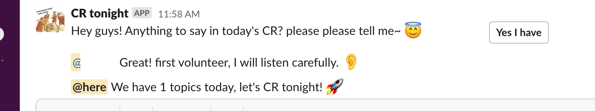

# slack-cr-reminder

This is a bot, design send daily message for checking how may pepole will joining today code review.


# Prepare

Create an Slack app, can follow this [document](https://slack.dev/bolt-python/tutorial/getting-started#tokens-and-installing-apps).

1. Navigate to the **OAuth & Permissions** on the left sidebar and scroll down to the Bot Token Scopes section. Click Add an OAuth Scope.
2. For now, we’ll just add one scope: `chat:write`. This grants your app the permission to post messages in channels it’s a member of.
3. Navigate to Socket Mode on the left side menu and toggle to enable.


## Usage

```shell
docker run --pull always --name slack-cr-reminder -rm \
    -e SLACK_APP_TOKEN=xapp-123 \
    -e SLACK_BOT_TOKEN=xoxb-123 \
    -e CHANNEL_ID=c11 \
    ghcr.io/abriko/slack-cr-reminder:latest
```